# Global Settings Guide

Access via **Edit > Project Settings > Plugins > IVSmoke**

These settings apply globally to all smoke volumes in your project. Settings are saved to `DefaultGame.ini`.

> Note: Settings may be reorganized into sub-sections in future updates. The functionality remains the same.
> 

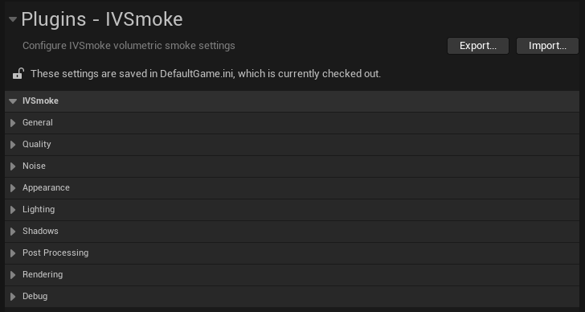

---

## General

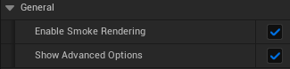

| Setting | Type | Default | Description |
| --- | --- | --- | --- |
| **Enable Smoke Rendering** | bool | `true` | Master toggle for the entire IVSmoke rendering system. Disable to turn off all smoke rendering without removing volumes. |
| **Show Advanced Options** | bool | `false` | Reveals additional advanced settings in Appearance, Lighting, and Shadows sections. Enable when fine-tuning specific behaviors. |

**Usage Tips:**

- Use **Enable Smoke Rendering** as a global kill switch for performance testing
- Enable **Show Advanced Options** only when you need precise control over edge fade, light override, or shadow bias

---

## Quality

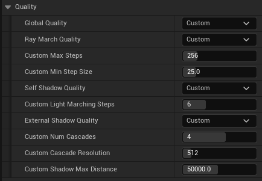

The Quality section provides a tiered system for balancing visual quality against performance.

| Setting | Type | Default | Description |
| --- | --- | --- | --- |
| **Global Quality** | Enum | `Medium (Balanced)` | Master quality preset that controls Ray Marching, Self-Shadow, and External Shadow quality together. |

## Global Quality Presets

| Preset | Ray March Steps | Min Step Size | Self-Shadow | External Shadow | Use Case |
| --- | --- | --- | --- | --- | --- |
| **Low** | 128 | 50.0 cm | 3 steps | Off | Mobile/Low-end PC, Maximum performance |
| **Medium** | 256 | 25.0 cm | 6 steps | On (512px) | Recommended for most projects |
| **High** | 512 | 16.0 cm | 8 steps | On (1024px) | High-end PC, Maximum quality |
| **Custom** | Per-section | Per-section | Per-section | Per-section | Independent control per section |

## Custom Quality Mode

When **Global Quality** is set to **Custom**, you can configure each quality section independently. Each section (Ray March, Self-Shadow, External Shadow) has its own quality preset selector.

## Ray March Quality

| Setting | Type | Default | Description |
| --- | --- | --- | --- |
| **Ray March Quality** | Enum | `Medium` | Controls ray marching precision. Can be set to Low/Medium/High/Custom. |

When Ray March Quality is **Custom**:

| Setting | Type | Range | Default | Description |
| --- | --- | --- | --- | --- |
| **Custom Max Steps** | int32 | 32-1024 | 256 | Maximum ray marching iterations per pixel |
| **Custom Min Step Size** | float | 5.0-100.0 | 25.0 | Minimum distance (cm) between ray samples |

## Self-Shadow Quality

| Setting | Type | Default | Description |
| --- | --- | --- | --- |
| **Self-Shadow Quality** | Enum | `Medium` | Controls internal smoke shadowing. Can be set to Off/Low/Medium/High/Custom. |

When Self-Shadow Quality is **Custom**:

| Setting | Type | Range | Default | Description |
| --- | --- | --- | --- | --- |
| **Custom Light Marching Steps** | int32 | 1-16 | 6 | Steps for light direction sampling |

## External Shadow Quality

| Setting | Type | Default | Description |
| --- | --- | --- | --- |
| **External Shadow Quality** | Enum | `Medium` | Controls Cascaded Shadow Map quality. Can be set to Off/Low/Medium/High/Custom. |

When External Shadow Quality is **Custom**:

| Setting | Type | Range | Default | Description |
| --- | --- | --- | --- | --- |
| **Custom Num Cascades** | int32 | 1-6 | 4 | Number of shadow cascade levels |
| **Custom Cascade Resolution** | int32 | 256-2048 | 512 | Shadow map texture resolution |
| **Custom Shadow Max Distance** | float | 1000-100000 | 50000 | Maximum shadow rendering distance (cm) |

## Performance Impact

- **Max Steps**: Higher values increase GPU cost linearly
- **Min Step Size**: Smaller values improve quality but require more steps
- **Cascade Resolution**: Memory usage scales quadratically (512x512 = 1MB, 1024x1024 = 4MB per cascade)

---

## Appearance

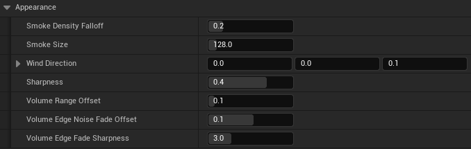

Controls the visual characteristics of the smoke.

| Setting | Type | Range | Default | Description |
| --- | --- | --- | --- | --- |
| **Smoke Density Falloff** | float | 0.0-1.0 | 0.2 | Edge softness. Lower values create softer, more gradual edges. Higher values create sharper, more defined boundaries. |
| **Smoke Size** | float | 1.0-1000.0 | 128.0 | Scale of the noise sampling. Larger values create bigger, more billowy smoke patterns. |
| **Wind Direction** | FVector | - | (0, 0, 0.1) | Direction and speed of wind animation. The magnitude affects speed. |
| **Sharpness** | float | -1.0 to 1.0 | 0.4 | Post-process sharpening/blur. Negative = blur, Positive = sharpen. |

## Advanced Options (Show Advanced Options = true)

| Setting | Type | Range | Default | Description |
| --- | --- | --- | --- | --- |
| **Volume Range Offset** | float | 0.0-1.0 | 0.1 | Offset for volume boundary calculation. Adjusts where smoke starts to appear. |
| **Volume Edge Noise Fade Offset** | float | -1.0 to 1.0 | 0.1 | Noise-based fade at volume edges. |
| **Volume Edge Fade Sharpness** | float | 0.1-10.0 | 3.0 | Sharpness of the edge fade transition. Higher = more abrupt cutoff. |

**Visual Guide:**

```
Smoke Density Falloff:
  0.0 [====    ] Very soft, gradient edges
  0.5 [======  ] Moderate definition
  1.0 [========] Sharp, hard edges

Sharpness:
 -1.0 [  blur  ] Maximum blur
  0.0 [ normal ] No adjustment
  1.0 [ sharp  ] Maximum sharpening
```

---

## Lighting

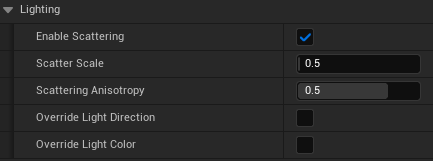

Controls how the smoke interacts with scene lighting.

| Setting | Type | Range | Default | Description |
| --- | --- | --- | --- | --- |
| **Enable Scattering** | bool | - | `true` | Enables Rayleigh/Mie scattering simulation for realistic light behavior through smoke. |
| **Scatter Scale** | float | 0.0-10.0 | 0.5 | Intensity of the scattering effect. Higher values make smoke appear brighter when lit. |
| **Scattering Anisotropy** | float | -0.99 to 0.99 | 0.5 | Henyey-Greenstein phase function parameter. Controls light scattering direction. |

**Scattering Anisotropy Explained:**

```
-0.99: Back-scattering (light bounces back toward source)
 0.00: Isotropic (light scatters equally in all directions)
+0.99: Forward-scattering (light passes through, creating glow effects)

Typical values:
  Smoke/Fog: 0.3 ~ 0.6 (slight forward scattering)
  Clouds: 0.7 ~ 0.85 (strong forward scattering, silver lining effect)
```

## Advanced Options (Show Advanced Options = true)

| Setting | Type | Default | Description |
| --- | --- | --- | --- |
| **Override Light Direction** | bool | `false` | Use custom light direction instead of Directional Light. |
| **Light Direction Override** | FVector | (0, 0, 1) | Custom light direction when override is enabled. |
| **Override Light Color** | bool | `false` | Use custom light color instead of Directional Light color. |
| **Light Color Override** | FLinearColor | White | Custom light color when override is enabled. |

---

## Shadows

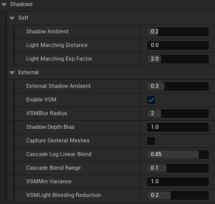

The Shadows section is divided into **Self** (internal smoke shadows) and **External** (shadows from scene objects).

## Self Shadows

Self-shadowing creates depth within the smoke by calculating how much light is blocked as it travels through the volume.

| Setting | Type | Range | Default | Description |
| --- | --- | --- | --- | --- |
| **Shadow Ambient** | float | 0.0-1.0 | 0.2 | Minimum brightness in shadowed areas. 0 = pitch black shadows, 1 = no shadows. |
| **Light Marching Distance** | float | 0.0-500.0 | 0.0 | Maximum distance (cm) to trace toward light. 0 = Automatic (traces until exiting volume). |
| **Light Marching Exp Factor** | float | 1.0-5.0 | 2.0 | Exponential distribution for light samples. Higher values concentrate samples near the surface. |

## External Shadows

External shadows allow smoke to receive shadows from scene geometry using Cascaded Shadow Maps (CSM).

| Setting | Type | Range | Default | Description |
| --- | --- | --- | --- | --- |
| **External Shadow Ambient** | float | 0.0-1.0 | 0.3 | Minimum brightness in externally shadowed areas. |
| **Enable VSM** | bool | - | `true` | Use Variance Shadow Maps for softer shadow edges. |
| **VSM Blur Radius** | int32 | 0-8 | 2 | Blur radius for VSM. Higher = softer shadows. |
| **Shadow Depth Bias** | float | 0.0-100.0 | 1.0 | Bias to prevent shadow acne artifacts. |
| **Capture Skeletal Meshes** | bool | - | `false` | Include animated characters in shadow casting. Increases cost. |
| **Cascade Log Linear Blend** | float | 0.0-1.0 | 0.85 | Blend between logarithmic and linear cascade distribution. |
| **Cascade Blend Range** | float | 0.0-0.3 | 0.1 | Soft transition range between cascade levels. |
| **VSM Min Variance** | float | 0.01-100.0 | 1.0 | Minimum variance threshold to prevent light bleeding in thin shadows. |
| **VSM Light Bleeding Reduction** | float | 0.0-0.5 | 0.2 | Reduces light bleeding artifacts at shadow edges. |

---

## Post Processing

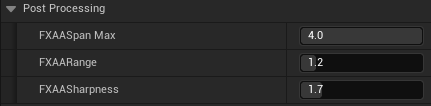

Controls the FXAA anti-aliasing applied specifically to smoke edges.

| Setting | Type | Range | Default | Description |
| --- | --- | --- | --- | --- |
| **FXAA Span Max** | float | 0.0-4.0 | 4.0 | Maximum edge search distance. Higher values smooth longer edges. |
| **FXAA Range** | float | 0.0-8.0 | 1.2 | Edge detection threshold. Lower = more aggressive smoothing. |
| **FXAA Sharpness** | float | 0.1-8.0 | 1.7 | Sharpening applied during FXAA. Counteracts blur from anti-aliasing. |

---

## Rendering

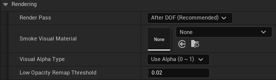

Controls the render pipeline integration.

| Setting | Type | Default | Description |
| --- | --- | --- | --- |
| **Render Pass** | Enum | `After DOF (Recommended)` | When in the post-process chain to render smoke. |
| **Smoke Visual Material** | Soft Object Path | None | Optional material for custom smoke visuals. |
| **Visual Alpha Type** | Enum | `Use Alpha (0~1)` | How alpha blending is calculated. |
| **Low Opacity Remap Threshold** | float | 0.02 | Remaps low opacity values to prevent HDR burn-in artifacts. |

## Render Pass Options

| Option | Description | Use Case |
| --- | --- | --- |
| **Before DOF** | Renders before Depth of Field | Smoke participates in DOF blur. Best quality but particles render on top. |
| **After DOF (Recommended)** | Renders after Depth of Field | Smoke remains sharp. Particles can be depth-sorted. |
| **Translucency After DOF** | Renders with separate translucency | Required for Custom Depth sorting. See [Translucent / Custom Depth](https://www.notion.so/IVSmoke-User-Guide-2f747ec9719f80978337fc22e2ecfe8c?pvs=21). |

## Visual Alpha Type Options

| Option | Description |
| --- | --- |
| **Use Alpha (0~1)** | Standard alpha blending. Smooth transparency transitions. |
| **Use CutOff** | Binary alpha based on threshold. Creates hard-edged smoke. |

---

## Debug

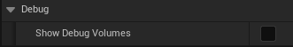

| Setting | Type | Default | Description |
| --- | --- | --- | --- |
| **Show Debug Volumes** | bool | `false` | Displays wireframe bounds for all smoke volumes in the viewport. |

---

## Smoke Preset

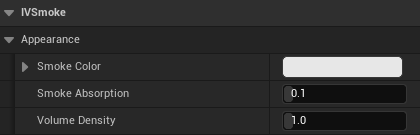

**Smoke Presets** are Data Assets that define per-volume appearance settings. Use presets to create reusable smoke configurations (white smoke, colored smoke, thick/thin smoke, etc.).

### Creating a Smoke Preset

1. In **Content Browser**, right-click
2. Select **Miscellaneous > Data Asset**
3. Choose `IVSmokeSmokePreset` as the class
4. Name it descriptively (e.g., `DA_SmokePreset_WhiteThick`)

### Preset Properties

| Property | Type | Range | Default | Description |
| --- | --- | --- | --- | --- |
| **Smoke Color** | FLinearColor | - | (0.8, 0.8, 0.8, 1.0) | RGB color of the smoke. Alpha is ignored. |
| **Smoke Absorption** | float | 0.0-1.0 | 0.1 | Light absorption coefficient. Higher values create denser, more opaque smoke. |
| **Volume Density** | float | 0.0-10.0 | 1.0 | Overall density multiplier for this volume. |

### Applying a Preset

1. Select your `AIVSmokeVoxelVolume` actor in the level
2. In the Details panel, find **IVSmoke | Config > Smoke Preset Override**
3. Assign your Smoke Preset data asset

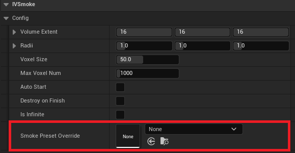

### Preset Examples

| Preset Name | Color | Absorption | Density | Use Case |
| --- | --- | --- | --- | --- |
| White Smoke | (0.9, 0.9, 0.9) | 0.1 | 1.0 | Standard smoke grenade |
| Thick Black | (0.1, 0.1, 0.1) | 0.3 | 2.0 | Heavy industrial smoke |
| Red Signal | (0.8, 0.2, 0.1) | 0.15 | 1.2 | Signal/marker smoke |
| Thin Mist | (0.7, 0.7, 0.8) | 0.05 | 0.5 | Light fog/mist effect |

---

## Translucent / Custom Depth

When smoke needs to correctly sort with translucent objects (like fire effect, or glass), use the **Custom Depth** sorting feature.

### The Problem

By default, smoke renders in a single post-process pass. Translucent particles (Niagara/Cascade) may appear incorrectly in front of or behind the smoke regardless of actual depth.

### The Solution: Custom Depth Sorting

1. **Set Render Pass** to `Translucency After DOF`
2. **Enable** `Use CustomDepth Sorting` checkbox (appears only when Translucency After DOF is selected)
3. **Configure particles** to write Custom Depth

### Setup Steps

### Step 1: Configure IVSmoke Settings

1. Go to **Project Settings > Plugins > IVSmoke > Rendering**
2. Set **Render Pass** to `Translucency After DOF`
3. Check **`Use CustomDepth Sorting`**

### Step 2: Configure Translucent Material

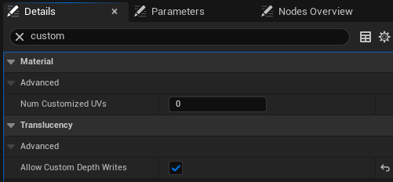

For each material that should sort with smoke:

1. Open your Material
2. Type ‘**Custom**’ on search bar in **Details tab**
3. Check **`Allow Custom Depth Writes`**

### Step 3: Enable Custom Depth on Each Components

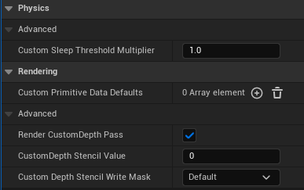

For each component that should sort with smoke:

1. Select your component from **Details**
2. Go to **Rendering > Advanced**
3. Check `Render CustomDepth Pass`

### Step 4: Enable Project Custom Depth

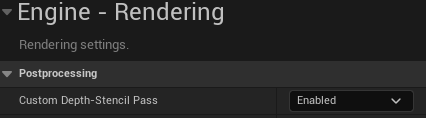

1. Go to **Project Settings > Engine > Rendering**
2. Set **Custom Depth-Stencil Pass** to `Enabled with Stencil`

### Step 5: Set Opacity Mask Clip Value (Optional)

For proper depth testing across all opacity ranges, you must set a low **Opacity Mask Clip Value** on your particle materials:

1. Open your particle material
2. Set **Opacity Mask Clip Value** to a low value (e.g., `0.01`)
3. This ensures that particles with any visible opacity correctly write to Custom Depth

### How It Works

```
Without Custom Depth:
┌─────────────────────────────┐
│ Scene Color                 │
├─────────────────────────────┤
│ Smoke (always on top)       │  ← Problem: Ignores depth
├─────────────────────────────┤
│ Particles                   │
└─────────────────────────────┘

With Custom Depth Sorting:
┌─────────────────────────────┐
│ Scene Color                 │
├─────────────────────────────┤
│ Per-pixel depth comparison  │  ← Reads Custom Depth + Scene Depth
│ Smoke OR Particle           │  ← Composites based on depth
└─────────────────────────────┘
```

### Performance Considerations

| Feature | Cost |
| --- | --- |
| Custom Depth Pass | Low (if already enabled) |
| Depth-Sorted Compositing | Medium (additional texture reads per pixel) |
| Particle Custom Depth Output | Low per particle |

**Recommendation:** Only enable Custom Depth sorting when you have translucent particles that must correctly intersect with smoke volumes.

---

## Editor Preview

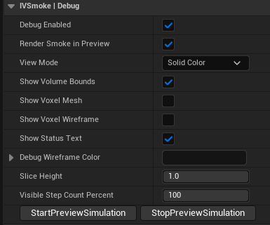

The **Editor Preview** feature allows you to preview smoke simulation directly in the editor viewport without entering Play mode.

### Starting Preview

1. Select an `AIVSmokeVoxelVolume` actor in your level
2. In the Details panel, find **IVSmoke | Debug**
3. Ensure **Debug Enabled** is checked
4. Click **Start Preview Simulation**

The smoke will begin simulating through its lifecycle phases (Expansion → Sustain → Dissipation) directly in the editor viewport.

### Stopping Preview

Click **Stop Preview Simulation** to immediately halt the simulation and clear all voxel data.

### Debug Visualization Options

| Setting | Type | Default | Description |
| --- | --- | --- | --- |
| **Debug Enabled** | bool | `true` | Master toggle for all debug features. |
| **Render Smoke In Preview** | bool | `true` | Whether to render the actual smoke visual during preview. |
| **View Mode** | Enum | `Solid Color` | Visualization mode: Solid Color or Heatmap (density-based). |
| **Show Volume Bounds** | bool | `true` | Display the bounding box of the smoke volume. |
| **Show Voxel Mesh** | bool | `false` | Render each active voxel as a cube mesh. **Heavy - use sparingly.** |
| **Show Voxel Wireframe** | bool | `true` | Draw wireframe cubes for active voxels. Lighter than mesh. |
| **Show Status Text** | bool | `true` | Display state, voxel count, and simulation time as floating text. |
| **Debug Wireframe Color** | FColor | Dark Gray | Color for debug wireframes. |
| **Slice Height** | float | 1.0 | Display only voxels below this height (0-1 normalized). Useful for inspecting internal structure. |
| **Visible Step Count Percent** | int32 | 100 | Percentage of simulation steps to visualize. |

### Preview Workflow Tips

1. **Rapid Iteration**: Adjust Volume parameters, click Start Preview, observe results, stop, adjust, repeat
2. **Use Wireframe Mode**: Enable `Show Voxel Wireframe` to see the simulation structure without heavy mesh rendering
3. **Status Monitoring**: Keep `Show Status Text` enabled to track voxel count and current simulation phase

### Limitations

- Editor Preview does not trigger network replication
- Holes created during preview are local only
- Performance in preview may differ from packaged builds

---

## Stat IVSmoke

IVSmoke provides detailed statistics for performance profiling and VRAM monitoring.

### Enabling Stats

Open the console (`~` key) and type:

```
stat IVSmoke
```

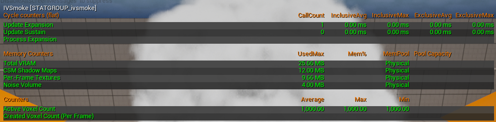

### Available Statistics

### Memory Stats (GPU VRAM)

| Stat Name | Description |
| --- | --- |
| **Noise Volume** | Memory used by the 3D noise texture. Static after generation. |
| **CSM Shadow Maps** | Memory used by Cascaded Shadow Maps. Scales with resolution and cascade count. |
| **Per-Frame Textures** | Temporary textures allocated each frame (voxel atlas, occupancy, etc.). |
| **Total VRAM** | Sum of all IVSmoke GPU memory usage. |

### Cycle Stats (CPU/GPU Time)

| Stat Name | Description |
| --- | --- |
| **Update Expansion** | Time spent in the expansion phase (voxel creation). |
| **Update Sustain** | Time spent in the sustain phase (maintenance). |
| **Update Dissipation** | Time spent in the dissipation phase (voxel removal). |
| **Process Expansion** | Actual voxel creation logic execution time. |
| **Prepare Dissipation** | Setup time for dissipation phase. |
| **Process Dissipation** | Actual voxel removal logic execution time. |

### Counter Stats

| Stat Name | Description |
| --- | --- |
| **Active Voxel Count** | Current number of active voxels across all volumes. |
| **Created Voxel Count (Per Frame)** | Voxels created this frame. |
| **Destroyed Voxel Count (Per Frame)** | Voxels removed this frame. |

### Using with Unreal Insights

For deeper analysis, use **Unreal Insights** profiler:

1. Launch with `trace=default,ivsmoke`
2. Open **Tools > Unreal Insights**
3. Filter by "IVSmoke" to see detailed timing breakdown

---

## Best Practices

### Recommended Level Placement

When placing smoke volumes in your level, consider these guidelines:

### Spacing and Distribution

- **Avoid clustering**: Do not spawn many smoke volumes in the same location simultaneously. Overlapping volumes in the same area can cause rendering artifacts and significant performance drops.
- **Stagger activation**: If multiple smoke grenades land near each other, consider staggering their activation times slightly.
- **Use adequate spacing**: Maintain reasonable distance between simultaneously active smoke volumes.

### Volume Sizing

- **Match gameplay needs**: Size your smoke volumes to cover the intended area without excessive overlap.
- **Consider sightlines**: Place smoke to block key sightlines rather than covering entire areas.

### Performance Tips

- **Limit simultaneous volumes**: Keep the number of simultaneously active smoke volumes reasonable for your target hardware.
- **Use appropriate quality settings**: Match quality settings to your target platform.
- **Test with worst-case scenarios**: Test performance with the maximum expected number of simultaneous smoke volumes.

---

*Copyright (c) 2026, Team SDB. All rights reserved.*