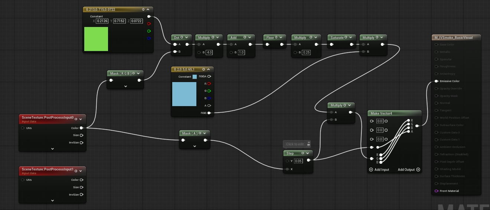
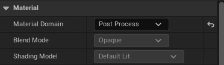
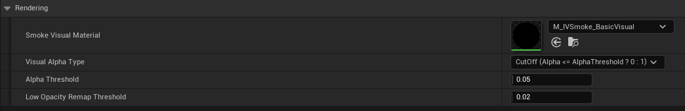
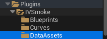

# Custom Material Guide

## Material

### Demo Example



- Material Domain : PostProcess



- **SmokeTexture**: Create a **SceneTexture** node → Scene Texture ID: **[PostProcessInput0]**
- **SmokeLocalPosAlphaTexture (LocalPos(x,y,z), Alpha)**: Create a **SceneTexture** node → Scene Texture ID: **[PostProcessInput1]**
- **SmokeWorldPosDepthTexture (WorldPos(x,y,z), Depth)**: Create a **SceneTexture** node → Scene Texture ID: **[PostProcessInput4]**
- **Output**: **Emissive Color (RGB)**

---

## Visual Material Preset

### Create
Content Drawer → Right-click → Miscellaneous → Data Asset → Select [IVSmoke Visual Material Preset]


### Configuration


- **Smoke Visual Material**: User-custom smoke material slot
    - If empty, the system returns **SmokeTexture** as-is
- **Visual Alpha Type**: Defines how the smoke alpha is processed
    - **Use Alpha**: Use the alpha value as-is
    - **CutOff**: `(Alpha ≤ AlphaThreshold ? 0 : 1)`
- **Alpha Threshold**: Threshold value used in **Visual Alpha Type = CutOff** mode
- **Low Opacity Remap Threshold**: Handling of very low alpha values

```
if (SmokeAlpha < LowOpacityRemapThreshold)
{
	SmokeAlpha = max(0.0, (SmokeMask - LowOpacityRemapThreshold * 0.5f) * 2.0);
}
```
---
## Project Setting Visual Material Preset

- **Search project setting for IVSmoke**
- **In the Rendering section, insert it into the Smoke Visual Material Preset slot.**
---

## Example

**Demo Material Path** : Plugins → IVSmoke → DataAssets → D_IVSmoke_VisualMaterialPreset



[IVSmoke_Option_Material.gif](IVSmoke_Option_Material.gif)

---

*Copyright (c) 2026, Team SDB. All rights reserved.*