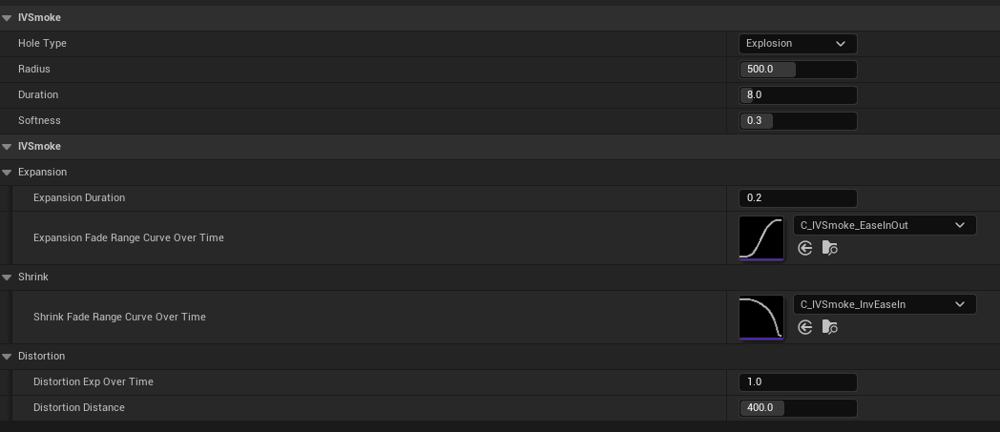
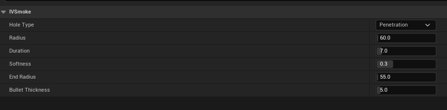
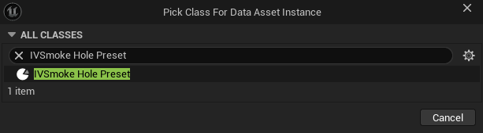
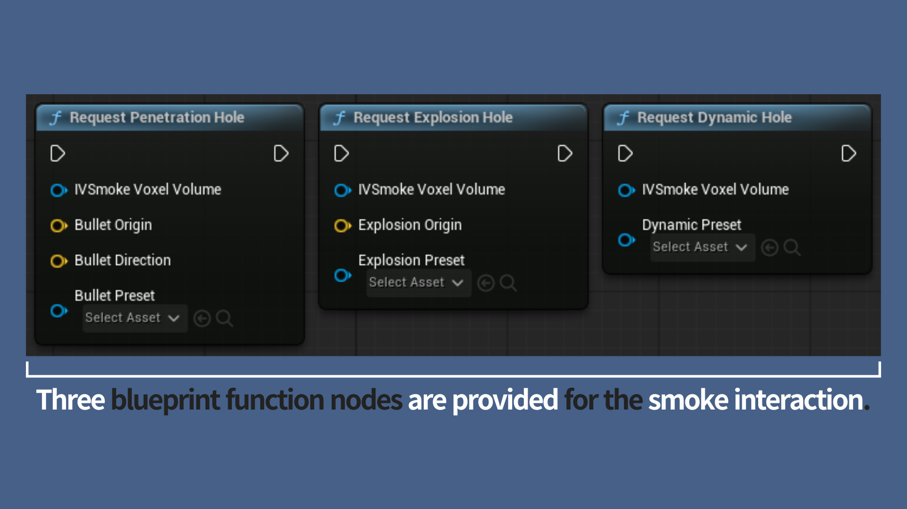
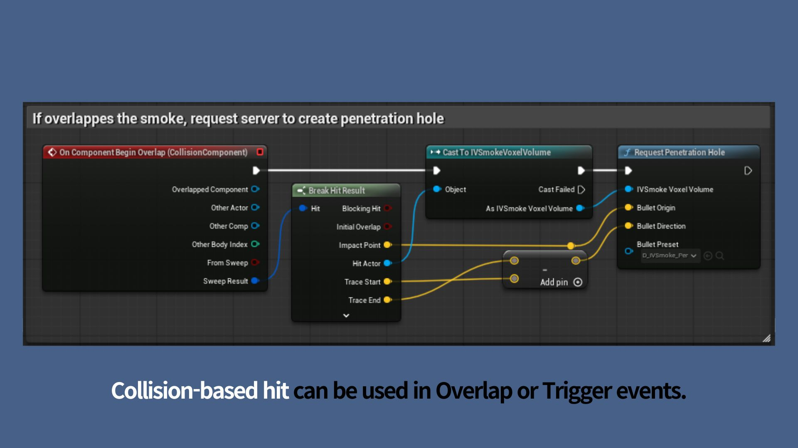
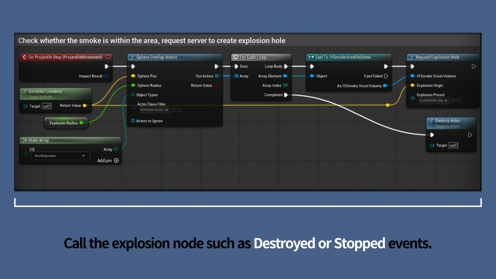
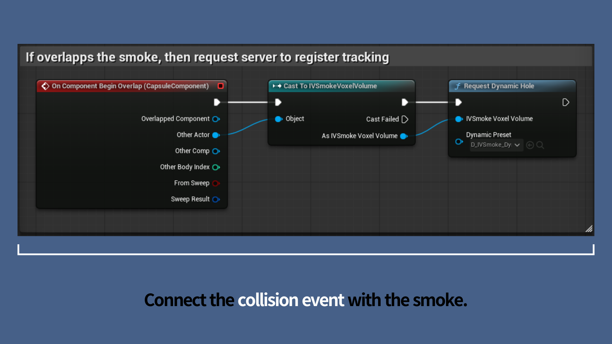

# HoleGenerator Component Guide

## Explosion (Grenade)

- **HoleType**: Type of hole
- **Radius**: Hole size
- **Duration**: Hole lifetime (seconds)
- **Softness**: Edge softness of the hole (0–1)
- **Expansion Duration**: Expansion time when the grenade explodes (seconds)
- **Expansion Fade Range Curve Over Time**: Range curve over expansion time (Expansion Duration)
    - **x**(0–1): Expansion range × Radius
    - **y**(0–1): Time × Expansion Duration
- **Shrink Fade Range Curve Over Time**: Range curve over shrink time (Duration − Expansion Duration)
    - **x**(0–1): Expansion range× Radius
    - **y**(0–1): Time × (Duration − Expansion Duration)
- **Distortion Exp Over Time**: Exponent value used in distortion calculation over time
- **Distortion Distance**: Maximum distortion distance

---

## Penetration (Bullet)

- **HoleType**: Type of hole
- **Radius**: Hole size at the initial collision point with the smoke
- **Duration**: Hole lifetime (seconds)
- **Softness**: Edge softness of the hole (0–1)
- **EndRadius**: Hole size at the exit point where the bullet leaves
    - The hole size at each position interpolates linearly from **Radius** to **EndRadius**
- **Bullet Thickness**: Actual physical collision size of the bullet

---

---

Demo preset path : Plugins → IVSmoke → DataAssets

**To create a new Preset, follow these steps**

## Create

Content Drawer → Right-click → Miscellaneous → Data Asset → Select [IVSmoke Hole Preset]

---

## Usage

### **Selecting the Right Interaction Node**

> Choose the API node that best aligns with the specific physical behavior you intend to simulate
> 
> 1. **Penetration (Request Penetration Hole):** Used for simulating high-speed, **linear trajectories**. This is ideal for bullet paths, railgun shots, or any projectile that pierces through smoke in a straight line.
> 2. **Explosion (Request Explosion Hole):** Designed for creating **spherical void areas**. Use this to represent the instantaneous impact of grenades, mortar shells, or any point-based radial blast.
> 3. **Dynamic (Request Dynamic Hole):** Tailored for **real-time tracking**. This node allows the smoke void to follow a moving subject—such as a character or vehicle—maintaining a continuous interaction as the actor navigates through the volume.

### Before. Add UIVSmokeHoleRequestComponent

Before utilizing any Request Nodes, ensure that the **`UIVSmokeHoleRequestComponent`** has been added to the subject Character or Pawn class actor.

- **Role:** This component facilitates the interaction queries between the actor and the smoke volume.
- **Dependency:** It is a mandatory requirement if you are using an **`AIVSmokeVoxelVolume`** actor equipped with the **`UIVSmokeHoleGeneratorComponent`** to generate smoke holes.

### Case A. Request Penetration Hole

This node is used to simulate the trajectories of high-speed projectiles that pierce through smoke in a straight line, such as bullets or railgun rounds.

### **Execution Timing**

Trigger this node when physical detection is confirmed—specifically during events such as **Hit**, **Overlap**, or **Destruction** of the projectile object.

| **Pin Name** | **Connection Value & Method** | **Notes** |
| --- | --- | --- |
| **Target** | Call **Get Hole Requester** node | References the `UIVSmokeHoleRequestComponent`. **Mandatory for multiplayer functionality;** it will not function if left empty. |
| **IVSmokeHoleGeneratorComponent** | `Other Comp` from Overlap/Hit | Connect the `IVSmokeHoleGeneratorComponent` belonging to the collided smoke volume. |
| **Origin** | Actor's **World Location** | The world coordinates where penetration begins. This defines the start point for the linear trajectory calculation. |
| **Direction** | Actor's **Forward Vector** | A **normalized unit vector** representing the projectile's heading. It is used in conjunction with the Origin to calculate the path through the smoke. |
| **Preset** | Dropdown Menu | You must assign an `IVSmokeHolePreset` data asset. **Note: The Preset type should be set to "Explosion."** |

### Case B. Request Explosion Hole

This node is used to simulate **spherical (radial) void areas** in smoke, typically caused by explosive devices like grenades, C4, or artillery shells.

### **Execution Timing**

Trigger this node at the moment the explosion is finalized. This is usually during events such as **Hit (OnComponentHit)**, **Overlap (OnComponentBeginOverlap)**, or when the projectile actor is **Destroyed**.

| **Pin Name** | **Connection Value & Method** | **Notes** |
| --- | --- | --- |
| **Target** | Call **Get Hole Requester** node | References the `UIVSmokeHoleRequestComponent`. **Mandatory for multiplayer;** the request will fail if this component is not registered. |
| **IVSmokeHoleGeneratorComponent** | `Other Comp` from Overlap/Hit | Connect the `IVSmokeHoleGeneratorComponent` of the smoke volume that was hit. |
| **Origin** | Actor's **World Location** | Specifies the center of the explosion. Use the object's current world coordinates to define the axis of the spherical clearing. |
| **Preset** | Dropdown Menu | You must assign a valid `IVSmokeHolePreset` data asset. **The Preset type must be set to "Explosion."** |

### Case C. Request Dynamic Hole

Use this node when you need to **dynamically clear smoke or maintain a hole in real-time** based on the movement path of an object, such as a character or a vehicle.

### **Execution Timing**

This node should be triggered by the **`OnComponentBeginOverlap`** event from the actor's `CollisionComponent`. Once triggered, the system will automatically track the actor and manage the smoke interaction.

| **Pin Name** | **Connection Value & Method** | **Notes** |
| --- | --- | --- |
| **Target** | Call **Get Hole Requester** node | References the `UIVSmokeHoleRequestComponent`. **Mandatory for multiplayer;** ensure this component is added to your actor. |
| **IVSmokeHoleGeneratorComponent** | `Other Comp` from Overlap | Connect the `IVSmokeHoleGeneratorComponent` belonging to the smoke volume the actor has entered. |
| **Target Actor** | **Self** (Reference to Self) | Specifies the subject actor to be tracked. The smoke hole will follow this actor’s movement. |
| **Instigator** | **Get Controller** | **Crucial for multiplayer.** You must provide the Controller to ensure the action is correctly attributed and synchronized across the network. |
| **Preset** | Dropdown Menu | Assign the `IVSmokeHolePreset` data asset. **The Preset type must be set to "Dynamic."** |

---

*Copyright (c) 2026, Team SDB. All rights reserved.*